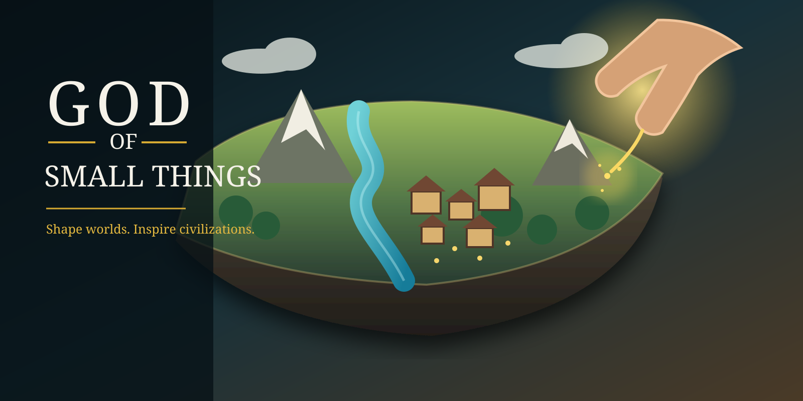
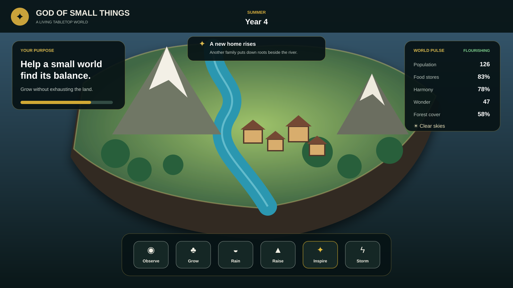
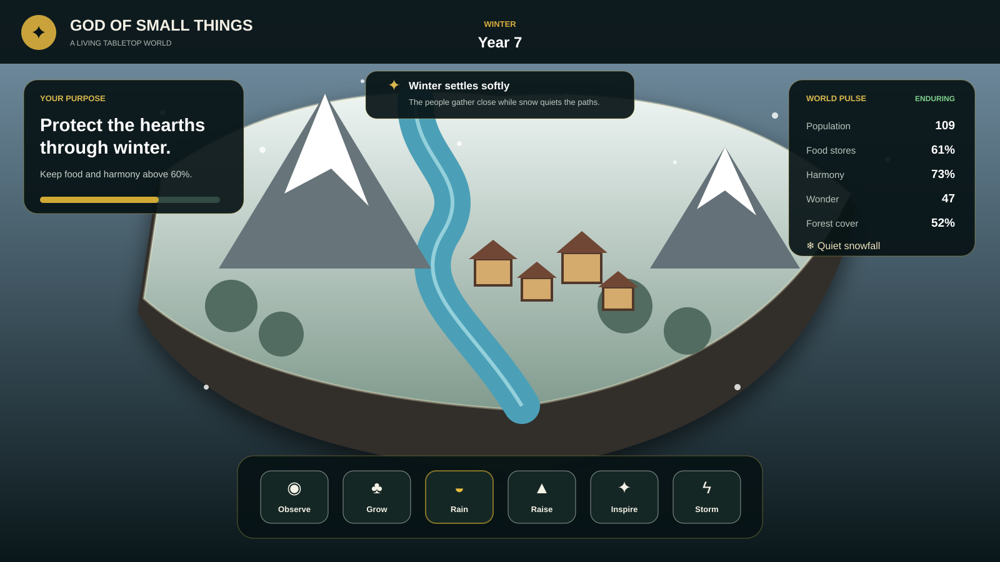

<p align="center">
  
</p>

<h1 align="center">God of Small Things</h1>

<p align="center">
  <strong>A living tabletop civilization simulator built with Three.js.</strong><br />
  Shape terrain, climate, and culture—then watch tiny societies adapt to the world you create.
</p>

<p align="center">
  <a href="https://raw.githack.com/benclawbot/God-of-Small-Things/main/index.html"><strong>Play the browser build</strong></a>
  ·
  <a href="#how-to-play">How to play</a>
  ·
  <a href="#development">Development</a>
</p>

<p align="center">
  
  
  
  
</p>

## The idea

You are a god, but not a commander. The people build, migrate, celebrate, struggle, and change on their own. Your influence is indirect: grow forests, call rain, raise ridges, inspire communities, or unleash storms. Every intervention improves some conditions while putting pressure on others.

The prototype is designed specifically for modest laptops—including machines with 16 GB RAM and integrated graphics—without sacrificing a strong visual identity.

## Screenshots

<p align="center">
  
</p>

<p align="center">
  
</p>

## Features

- **A procedural floating island** with mountains, rivers, forests, fields, paths, and two growing settlements.
- **Six divine powers** with meaningful ecological and social trade-offs.
- **Autonomous civilization simulation** covering population, food, harmony, wonder, soil, water, and forest health.
- **Seasonal and weather cycles** that visibly alter the island and influence its carrying capacity.
- **Living settlements** that add homes and citizens as conditions improve.
- **Adaptive rendering** using capped pixel density, instancing, limited shadows, and compact simulation updates.
- **Graceful Canvas fallback** when Three.js or WebGL is unavailable.
- **Seeded worlds** for repeatable simulations and easy testing.
- **Keyboard, mouse, trackpad, touch, and game-friendly controls** with no installation required.

## How to play

| Action | Control |
|---|---|
| Orbit the island | Drag the pointer |
| Zoom | Mouse wheel or trackpad pinch |
| Select a power | Bottom toolbar or keys `1`–`6` |
| Apply a power | Click or tap the island |
| Pause/resume | `Space` or time controls |
| Accelerate history | `▶▶` and `▶▶▶` |
| Generate a new world | Reset button in the top-right |

### Powers

| Power | Benefit | Cost or risk |
|---|---|---|
| Observe | Lets the simulation develop naturally | No direct intervention |
| Grow | Restores forest, soil, and wonder | Uses valuable land |
| Rain | Replenishes water and food | Can shift weather patterns |
| Raise | Improves soil and creates wonder | Temporarily reduces food |
| Inspire | Improves harmony and wonder | Communities pause production |
| Storm | Replenishes water quickly | Damages forest and harmony |

## Performance profile

The default scene is intentionally bounded for integrated graphics:

- Device pixel ratio capped at `1.5`
- Compact island rather than an open world
- Instanced trees and repeated geometry
- One primary shadow-casting light
- Limited visible citizens and houses
- Lightweight simulation updates independent of frame rate
- Automatic Canvas 2D fallback

For the lowest-power mode, append `?lite=1` or `?fallback=1` to the URL.

Use a repeatable world with `?seed=42042`.

## Architecture

```text
index.html
├── src/bootstrap.js     UI wiring, renderer selection, input
├── src/game.js          Three.js world, camera, effects, interaction
├── src/fallback.js      Canvas 2D low-power renderer
├── src/simulation.js    Deterministic civilization simulation
├── styles.css           Responsive glass-interface styling
└── tests/               Node-native simulation tests
```

Three.js is loaded as an ES module from cdnjs. There is no bundler and no production build step; the repository can be hosted as static files.

## Development

Requirements: Node.js 20 or newer.

```bash
git clone https://github.com/benclawbot/God-of-Small-Things.git
cd God-of-Small-Things
npm start
```

Open `http://localhost:4173`.

Run all checks:

```bash
npm run check
```

The test suite verifies deterministic generation, simulation bounds, power trade-offs, and settlement growth.

## Current prototype scope

This first playable release focuses on one polished island and the core simulation loop. Future expansions could add cultural identities, diplomacy, historical archives, additional biomes, disasters, monuments, and shareable world records.

## License

Released under the [MIT License](LICENSE).
